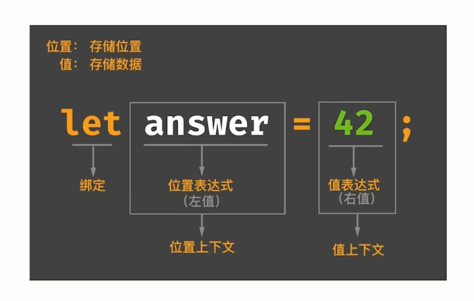
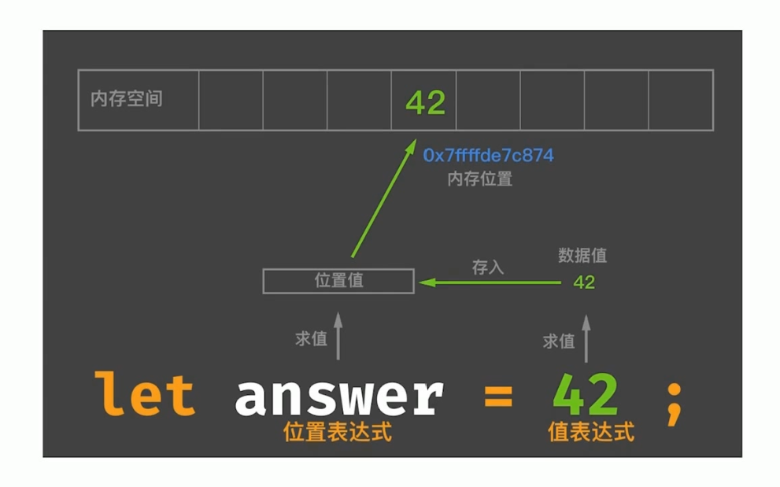

## Rust：面向表达式的语言
分号（`;`）和块（`{}`）是Rust语言的两个基本表达式。
### 分号表达式
`; -> ()`，分号表达式产生单元类型（Unit Type）。只有在块表达式最后一行才会进行求值，其他时候作为连接符存在。
### 块表达式
块表达式的返回值是块中最后一个表达式的值。即块表达只对其最后一行表达式进行求值。
## Rust编译期计算
### 什么是编译期计算？
编译期函数求值（CTFE, compile time function evaluation）。
Rust支持两种方式：
* 过程宏+Build脚本（build.rs）。
* 类似于C++中constexpr的CTFE功能。
### Rust的CTFE
* 常量函数（const fn）
* 常量泛型（const generic）
### 常量表达式与常量上下文
常量上下文包括：
* 常量初始化位置
* 静态数组的长度表达式`[T; N]`
* 重复长度表达式，类似于：`[0; 10]`
* 静态常量、枚举判别式的初始化位置
### 常量传播（const propagation）
* 常量传播是编译期的一种优化。
* 常量传播并不能改变程序的任何行为，并且对开发者是隐藏的。
* 编译期计算则是指编译时执行的代码，必须知道其结果，才能继续执行。
### 常量安全
* Rust里大部分表达式都可以用作常量表达式。
* 并不是所有的常量表达式都可以在常量上下文。
* 编译期求值必须得到一个确定性的结果。
### 常量函数
* 普通的fn关键字定义的函数，是SafeRust主类型系统保证安全。
* const fn定义的函数，是Safe Rust主类型系统下有一个专门用于常量计算的子类型系统来保证常量安全。
### while true vs. loop
Rust编译期为什么不识别while true？
* 要考虑：`while(constexpr == true)`的情况。
* 使用`#[allow(while_true)]`属性在某些情况下允许使用while true。
### 常量泛型
为什么需要常量泛型？  
Rust中静态数组一直以来都是“二等公民”，不方便使用。
## 表达式
### 位置表达式与值表达式
  
对位置表达式求值，得到代表内存位置的值，通过这个值可以得到内存地址。  
对值表达式求值，得到从属于内存位置的数据本身的值。
  
因此，数据存到哪个位置（堆、栈、静态存储区）还得看值表达式的类型。

