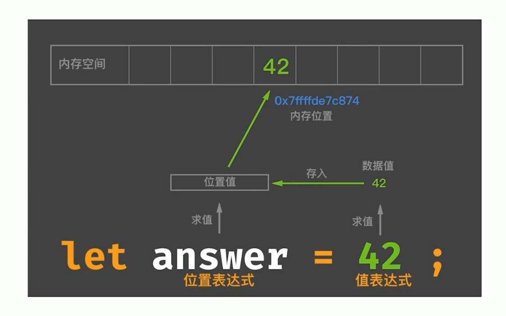
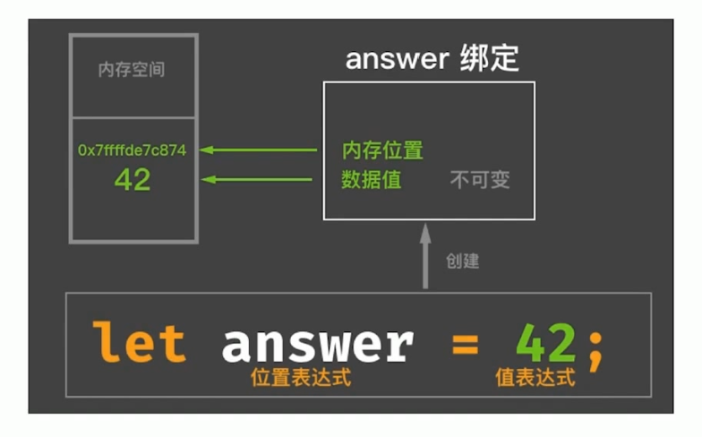
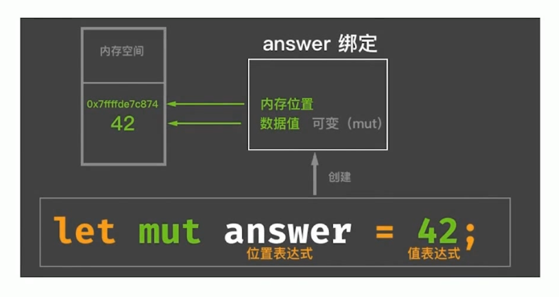
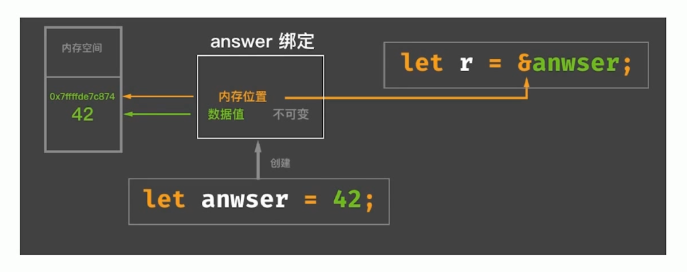

## Rust：面向表达式的语言
分号（`;`）和块（`{}`）是Rust语言的两个基本表达式。
### 分号表达式
`; -> ()`，分号表达式产生单元类型（Unit Type）。只有在块表达式最后一行才会进行求值，其他时候作为连接符存在。
### 块表达式
块表达式的返回值是块中最后一个表达式的值。即块表达只对其最后一行表达式进行求值。
## Rust编译期计算
### 什么是编译期计算？
编译期函数求值（CTFE, compile time function evaluation）。
Rust支持两种方式：
* 过程宏+Build脚本（build.rs）。
* 类似于C++中constexpr的CTFE功能。
### Rust的CTFE
* 常量函数（const fn）
* 常量泛型（const generic）
### 常量表达式与常量上下文
常量上下文包括：
* 常量初始化位置
* 静态数组的长度表达式`[T; N]`
* 重复长度表达式，类似于：`[0; 10]`
* 静态常量、枚举判别式的初始化位置
### 常量传播（const propagation）
* 常量传播是编译期的一种优化。
* 常量传播并不能改变程序的任何行为，并且对开发者是隐藏的。
* 编译期计算则是指编译时执行的代码，必须知道其结果，才能继续执行。
### 常量安全
* Rust里大部分表达式都可以用作常量表达式。
* 并不是所有的常量表达式都可以在常量上下文。
* 编译期求值必须得到一个确定性的结果。
### 常量函数
* 普通的fn关键字定义的函数，是SafeRust主类型系统保证安全。
* const fn定义的函数，是Safe Rust主类型系统下有一个专门用于常量计算的子类型系统来保证常量安全。
### while true vs. loop
Rust编译期为什么不识别while true？
* 要考虑：`while(constexpr == true)`的情况。
* 使用`#[allow(while_true)]`属性在某些情况下允许使用while true。
### 常量泛型
为什么需要常量泛型？  
Rust中静态数组一直以来都是“二等公民”，不方便使用。
## 表达式
### 位置表达式与值表达式
  
对位置表达式求值，得到代表内存位置的值，通过这个值可以得到内存地址。  
对值表达式求值，得到从属于内存位置的数据本身的值。  
  
因此，数据存到哪个位置（堆、栈、静态存储区）还得看值表达式的类型。
### 位置表达式
* 静态变量的初始化，如：`static mut LEVELS: u32 = 0;`
* 解引用表达式，如：`*p`
* 数据索引表达式，如：`arr[i]`
* 字段表达式，如：`st.field`
* 以及加上括号的位置表达式，如：`(expr)`
### 位置上下文
* 除了赋值左侧的位置上下文，还有“复合操作”的左侧。
```rust
let mut a = 1;
a += 1; // 复合赋值操作
```
* 一元“借用”和“解引用”操作中的操作数所在区域。
```rust
let a = &mut 7;
*a = 42;
let b = &a;
```
* 字段表达式的操作数所在区域。
```rust
struct A {
    name: &' static str,
}
let a = A{name: "Alex"};
a.name; // field expr
```
* 数组索引表达式的操作数所在区域。
```rust
let mut a = [1, 2, 3];
let b = &mut a;
a[1] = 42; // [1, 42, 3]
```
* 任意隐式借用操作数所在区域。
```rust
let mut v = vec![1, 2, 3];
v.push(4); // push方法会调用隐式借用&mut v，因为push方法的第一个参数是&mut self
```
* let语句初始化。
```rust
let a: i32;
a = 42; 
```
* if let / while let / match的匹配表达式所在区域。
```rust
let dish = ("Ham", "Eggs");
if let ("Bacon", b) = dish {
    // ...
} else {
    // ...
}

// while let (位置上下文) = ... { ... }
// match (位置上下文) { ... }
```
* 结构体更新语法中的base表达式（..操作符后面的操作数区域）
```rust
let mut base = Point3d{x: 1, y: 2, z: 3};
let y_ref = &mut base.y;
Point3d{y: 0, z: 10, .. base};
```
### 位置表达式出现在了值上下文中（意味着内存位置的Move或Copy）
```rust
let stack_a = 42; // 42是基本数据类型，实现了Copy Trait，表示可以安全的在栈上进行复制。
let stack_b = stack_a; // 出现在值上下文中，发生了Copy
stack_a; // ok

let heap_a = "hello".to_string(); // 在堆内存，未实现Copy
let heap_b = heap_a; // 发生Move
heap_a; // error
```
## 不可变与可变
Rust借鉴了函数式语言的不可变特性，包括：
* 不可变绑定与可变绑定。
* 不可变引用与可变引用。
### 默认不可变
  
如果想修改变量的值
```rust
let answer = 42;
let answer = 43;
```

### 不可变引用（共享引用）

### 可变引用（独占引用）

```rust
let mut answer = 42;
let r = &mut answer;
*r = 43;
```
因为不能改变内存位置的数据，因此可以有多个不可变引用。
可变引用只能有一个，因为会修改内存位置的数据，多以只能保持独占。
## Rust中的类型
* 基本数据类型
* 自定义复合类型
* 容器类型
* 泛型
* 特定类型
### 字符串
* 字面量
* 动态可增长字符串
* 从一段字符串中截取的片段
* 字符串编码
* FFI中需要转换字符串到C或OS本地字符串
* 遵循特定格式的文件路径
### 指针类型
* 原始指针，*mut T和*const T。
* NonNull指针。它是Rust建议的*mut T指针的替代指针。NonNull即非空指针，并且是遵循生命周期类型协变规则。
* 函数指针，指向代码的指针，而非数据。可以使用他直接调用函数。
### 引用
* &T和&mut T。
* 引用与指针的主要区别：
  * 引用不可能为空。
  * 拥有声明周期。
  * 受借用检查器保护不会发生悬垂指针等问题。
### 元组
唯一的异构序列
* 不同长度的元组是不同类型。
* 单元类型的唯一实例等价与空元组。
* 当元组只有一个元素的时候，要在元素末尾加逗号分隔，这是为了方便和括号操作符区分开来。
### Never类型
* 类型理论中，叫做底类型，底类型不包含任何值，但它可以合到任何其他类型。
* Never类型用“!”表示。
* 目前还未稳定，但是在Rust内部已经在使用了。
### 自定义复合类型
* 结构struct
* 枚举enum
* 联合union
#### struct
* 具名结构体
* 元组结构体
* 单元结构体
```rust
struct Point {
    x: f32,
    y: f32,
}
struct Pair(i32, f32);
struct Unit;
```
#### NewType模式
当元组结构体只包含一个成员时
```rust
struct Score(u32);
impl Score {
    fn pass(&self) -> bool {
        self.0 >= 60
    }
}
fn main() {
    let s = Score(59);
    assert_eq!(s.pass(), false);
}
```
## 内部可变性（interior mutability）
* 与继承式可变相对应
* 由可变性核心原语UnsafeCell<T>提供支持
* 基于UnsafeCell<T>提供了Cell<T>和RefCell<T>
### Cell\<T\>
```rust
use std::cell:Cell;
struct Foo {
    x: u32,
    y: Cell<u32>
}
fn main() {
    let foo = Foo{x: 1, y: Cell::new(3)};
    foo.y.set(5);
    assert_eq!(5, foo.y.get());
    
    let s = "hello".to_string();
    let bar = Cell::new(s);
    let x = bar.into_inner();
    bar; // error: use of moved value
}
```
`Cell<T>`是通过移进移出值达到内部可变的目的。
### RefCell\<T\>
```rust
use std::cell:RefCell;
fn main() {
    let x = RefCell::new(vec![1,2,3,4]);
    println("{:?}", x.borrow());
    x.borrow_mut().push(5);
    println("{:?}", x.borrow());
}
```
## 泛型
泛型即参数化类型
```rust
fn foo<T>(x: T) -> T {
    return x;
}
fn main() {
    assert_eq!(foo(1), 1);
    assert_eq!(foo("hello"), "hello");
}
```
## Rust中类型的行为
Rust中一切皆类型。类型系统如何保证类型的安全交互呢？
### 类型的行为
`trait`是行为的抽象，Rust引入其来统一行为接口。
### 孤儿规则
trait或类型必须有一个在本地定义。
### 仿射类型（Affine Type）
类型系统中用于标识内存等资源，最多智能被使用一次。
## 函数与闭包
### 常规函数
* 函数都拥有显式的类型签名
* 函数可分为三种类型：自由函数、关联函数和方法。
* 函数自身也是一种类型。
### 零大小类型的类型构造器
函数项默认实现了Copy/Clone/Sync/Send/Fn/FnMut/FnOnce。
### 结论
函数项类型可以通过显式指定函数类型转换为一个函数指针类型。
在写代码的时候，尽可能第使用函数项类型，不到万不得已，不要使用函数指针类型，这样有助于享受零大小类型的优化。
### 闭包
函数无法捕获环境变量，闭包可以。
```rust
fn counter(i: i32) -> fn(i32) -> i32 {
    fn inc(n: i32) -> i32 {
        n + i // error
    }
    inc
}
fn main() {
    let f = counter(2);
    assert_eq(3, f(1));
}
```
```rust
fn counter(i: i32) -> impl FnMut(i32) -> i32 {
    move |n| n + i
}
fn main() {
    let f = counter(2);
    assert_eq(3, f(1));
}
```
