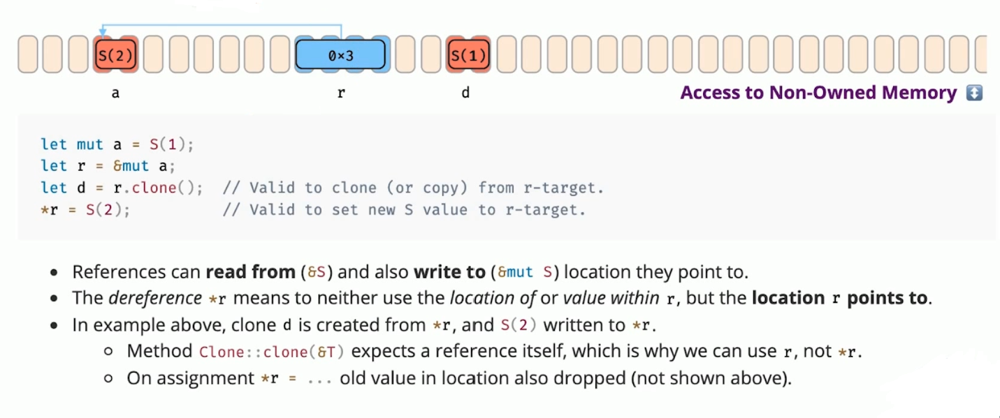

# Rust进阶
## Rust语言概念核心
* 所有权语义
* Rust的工程能力
* 元编程能力
* 认识Unsafe Rust
## OS内存管理通用知识
### 虚拟地址空间

### 函数调用栈

## Rust所有权机制
Rust出现之前，其他编程语言的内存管理方式。Rust基于所有权的安全内存管理模型。
### 其他语言内存管理方式
* C：纯手工管理内存
* C++：手工+确定性析构
* GC语言：垃圾回收
### Rust内存管理方式
* 考虑性能：借鉴C++的RAII资源管理方式。
* 考虑安全：增加所有权语义。
## 所有权
### 所有权语义模式

### 所有权类型系统
#### 移动语义（Move）

#### 复制语义（Copy）
impl Copy for SomeT.  

### 所有权内存管理
* 默认存储数据到栈上。
* 利用栈来自动管理堆内存。
  当函数调用结束的时候，本地变量就会被清理。如果本地变量中有指向堆内存的指针，也会随之被清理。
### 所有权借用

### 所有权共享
Rust中Clone trait在语义上表示：所有权共享。

